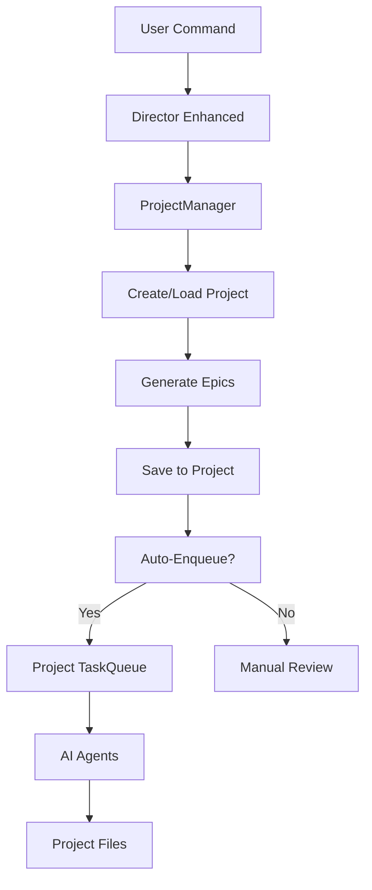

# 🔧 Project Management System - Technical Reference

> **Complete Technical Documentation for Agent Studio Project Management**

## 🏗️ System Architecture

### **Core Components**

```
Agent Studio Project Management
├── 📁 ProjectManager (project-manager.js)
│   ├── Project Creation & Lifecycle
│   ├── Folder Structure Generation
│   ├── Metadata Management
│   └── Active Project Tracking
├── 📁 Enhanced Director (director-enhanced.js)
│   ├── CLI Command Interface
│   ├── Epic Generation & Merging
│   ├── Auto-Enqueue Integration
│   └── Project Context Awareness
├── 📁 Project-Aware TaskQueue (task-queue.js)
│   ├── Project-Specific Queues
│   ├── Task Isolation
│   └── Agent Integration
└── 📁 Project Structure Templates
    ├── Vite Build Configuration
    ├── Package.json Templates
    └── Development Environment Setup
```

### **Data Flow**



---

## 📁 Project Structure Deep Dive

### **Complete Project Folder Structure**

```
2025-07-17T22-03-47_project-name_shortId/
├── 📄 project.json           # Project metadata and configuration
├── 📄 package.json           # Node.js dependencies and scripts
├── 📄 vite.config.js         # Vite build configuration
├── 📄 index.html             # Game entry point
├── 📄 README.md              # Project documentation
├── 📄 .gitignore             # Git ignore rules
├── 📁 src/                   # Source code directory
│   ├── 📄 main.js            # Main game file
│   ├── 📁 scenes/            # Phaser.js scenes
│   │   ├── 📄 BootScene.js   # Initial loading scene
│   │   ├── 📄 MenuScene.js   # Main menu scene
│   │   └── 📄 GameScene.js   # Primary game scene
│   ├── 📁 entities/          # Game objects and entities
│   │   ├── 📄 Player.js      # Player character
│   │   ├── 📄 Enemy.js       # Enemy base class
│   │   └── 📄 Collectible.js # Collectible items
│   ├── 📁 ui/                # User interface components
│   │   ├── 📄 HUD.js         # Heads-up display
│   │   ├── 📄 Menu.js        # Menu systems
│   │   └── 📄 Button.js      # UI button components
│   ├── 📁 systems/           # Game systems and managers
│   │   ├── 📄 AudioManager.js    # Sound and music
│   │   ├── 📄 ScoreManager.js    # Scoring system
│   │   └── 📄 SaveManager.js     # Save/load functionality
│   └── 📁 utils/             # Utility functions
│       ├── 📄 Constants.js   # Game constants
│       ├── 📄 Helpers.js     # Helper functions
│       └── 📄 Config.js      # Game configuration
├── 📁 assets/                # Game assets
│   ├── 📁 images/            # AI-generated images
│   │   ├── 📁 sprites/       # Character and object sprites
│   │   ├── 📁 backgrounds/   # Background images
│   │   ├── 📁 ui/            # UI elements and icons
│   │   └── 📁 effects/       # Particle and effect textures
│   ├── 📁 audio/             # Audio files
│   │   ├── 📁 music/         # Background music
│   │   ├── 📁 sfx/           # Sound effects
│   │   └── 📁 voice/         # Voice clips
│   └── 📁 fonts/             # Custom fonts
├── 📁 epics/                 # Project planning and epics
│   ├── 📄 epics.json         # Current epic list
│   ├── 📄 epic-history.json  # Epic generation history
│   └── 📁 archive/           # Previous epic versions
├── 📁 tasks/                 # AI agent task management
│   ├── 📁 tasks/             # Project-specific task queue
│   │   ├── 📁 pending/       # Tasks waiting for agents
│   │   ├── 📁 processing/    # Tasks currently being worked on
│   │   ├── 📁 completed/     # Finished tasks
│   │   └── 📁 failed/        # Failed tasks for review
│   └── 📄 queue-status.json  # Task queue metadata
├── 📁 logs/                  # Development and agent logs
│   ├── 📄 project.log        # General project log
│   ├── 📄 epic-generation.log    # Epic creation history
│   ├── 📄 agent-activity.log     # AI agent actions
│   └── 📁 daily/             # Daily log archives
└── 📁 dist/                  # Built/compiled game files
    ├── 📄 index.html         # Production game file
    ├── 📁 assets/            # Optimized assets
    └── 📁 js/                # Compiled JavaScript
```

### **File Content Examples**

#### **project.json Structure**
```json
{
  "id": "2025-07-17T22-03-47_retro-blaster-fury_19af74c3",
  "name": "Retro Blaster Fury",
  "slug": "retro-blaster-fury",
  "userPrompt": "Create a retro-style arcade shooter with power-ups and multiple weapon types",
  "description": "A classic arcade-style space shooter with modern enhancements",
  "createdAt": "2025-07-17T22:03:47.123Z",
  "updatedAt": "2025-07-17T22:15:32.456Z",
  "version": "1.0.0",
  "gameEngine": "phaser",
  "buildSystem": "vite",
  "folders": {
    "root": "C:\\Users\\...\\projects\\2025-07-17T22-03-47_retro-blaster-fury_19af74c3",
    "src": "C:\\Users\\...\\projects\\2025-07-17T22-03-47_retro-blaster-fury_19af74c3\\src",
    "assets": "C:\\Users\\...\\projects\\2025-07-17T22-03-47_retro-blaster-fury_19af74c3\\assets",
    "epics": "C:\\Users\\...\\projects\\2025-07-17T22-03-47_retro-blaster-fury_19af74c3\\epics",
    "tasks": "C:\\Users\\...\\projects\\2025-07-17T22-03-47_retro-blaster-fury_19af74c3\\tasks",
    "logs": "C:\\Users\\...\\projects\\2025-07-17T22-03-47_retro-blaster-fury_19af74c3\\logs"
  },
  "statistics": {
    "totalEpics": 12,
    "completedEpics": 8,
    "iterations": 3,
    "lastActivity": "2025-07-17T22:15:32.456Z",
    "agentActivity": {
      "coder": 6,
      "designer": 4,
      "uiux": 2
    }
  },
  "settings": {
    "autoEnqueue": false,
    "agentPreferences": {
      "priority": ["coder", "designer", "uiux"],
      "parallelExecution": true
    }
  },
  "tags": ["arcade", "shooter", "retro", "phaser"],
  "status": "active"
}
```

#### **Generated package.json**
```json
{
  "name": "retro-blaster-fury",
  "version": "1.0.0",
  "description": "A retro-style arcade shooter with power-ups and multiple weapon types",
  "main": "src/main.js",
  "scripts": {
    "dev": "vite",
    "build": "vite build",
    "preview": "vite preview",
    "test": "echo \"No tests yet\" && exit 0"
  },
  "dependencies": {
    "phaser": "^3.70.0"
  },
  "devDependencies": {
    "vite": "^4.4.0"
  },
  "keywords": ["game", "phaser", "arcade", "shooter"],
  "author": "Agent Studio",
  "license": "MIT"
}
```

#### **Vite Configuration**
```javascript
import { defineConfig } from 'vite';
import { resolve } from 'path';

export default defineConfig({
  root: '.',
  base: './',
  server: {
    port: 3000,
    open: true
  },
  build: {
    outDir: 'dist',
    assetsDir: 'assets',
    rollupOptions: {
      input: {
        main: resolve(__dirname, 'index.html')
      }
    }
  },
  resolve: {
    alias: {
      '@': resolve(__dirname, 'src'),
      '@assets': resolve(__dirname, 'assets')
    }
  }
});
```

---

## 🔧 ProjectManager Class Reference

### **Core Methods**

#### **createProject(userPrompt, options)**
```javascript
/**
 * Creates a new project with complete folder structure
 * @param {string} userPrompt - User's game description
 * @param {Object} options - Creation options
 * @param {string} options.name - Custom project name
 * @param {string} options.description - Project description
 * @returns {Object} Created project metadata
 */
async createProject(userPrompt, options = {}) {
  // 1. Generate unique project ID
  // 2. Create folder structure
  // 3. Generate configuration files
  // 4. Save project metadata
  // 5. Return project object
}
```

#### **listProjects()**
```javascript
/**
 * Lists all projects with metadata
 * @returns {Array} Array of project objects
 */
async listProjects() {
  // 1. Scan projects directory
  // 2. Load project.json for each
  // 3. Return sorted list
}
```

#### **getProject(projectId)**
```javascript
/**
 * Retrieves specific project by ID
 * @param {string} projectId - Project identifier
 * @returns {Object} Project metadata object
 */
async getProject(projectId) {
  // 1. Validate project ID
  // 2. Load project.json
  // 3. Return project data
}
```

#### **setActiveProject(projectId)**
```javascript
/**
 * Sets a project as the active project
 * @param {string} projectId - Project to activate
 */
async setActiveProject(projectId) {
  // 1. Validate project exists
  // 2. Update active project file
  // 3. Update project metadata
}
```

#### **getActiveProject()**
```javascript
/**
 * Gets the currently active project
 * @returns {Object|null} Active project or null
 */
async getActiveProject() {
  // 1. Read active project file
  // 2. Load project data
  // 3. Return project object
}
```

### **Folder Structure Generation**

#### **createProjectStructure(projectPath)**
```javascript
async createProjectStructure(projectPath) {
  // Creates complete directory structure
  const folders = [
    'src/scenes',
    'src/entities', 
    'src/ui',
    'src/systems',
    'src/utils',
    'assets/images/sprites',
    'assets/images/backgrounds',
    'assets/images/ui',
    'assets/images/effects',
    'assets/audio/music',
    'assets/audio/sfx',
    'assets/fonts',
    'epics',
    'epics/archive',
    'tasks/tasks/pending',
    'tasks/tasks/processing',
    'tasks/tasks/completed',
    'tasks/tasks/failed',
    'logs/daily',
    'dist'
  ];
  
  for (const folder of folders) {
    await fs.mkdir(path.join(projectPath, folder), { recursive: true });
  }
}
```

#### **generateConfigFiles(project)**
```javascript
async generateConfigFiles(project) {
  // 1. Generate package.json
  // 2. Create vite.config.js
  // 3. Create index.html
  // 4. Generate README.md
  // 5. Create .gitignore
  // 6. Generate starter source files
}
```

---

## 🎬 Enhanced Director System

### **Command Structure**

#### **Command Definitions**
```javascript
// New project command
program
  .command('new')
  .description('Create a new project')
  .argument('<prompt>', 'User prompt describing the game or project to build')
  .option('-n, --name <n>', 'Project name (auto-generated from prompt if not provided)')
  .option('-d, --description <desc>', 'Project description')
  .option('-e, --auto-enqueue', 'Automatically enqueue epics after generation', false)
  .action(async (prompt, options) => {
    await createNewProject(prompt, options);
  });

// Continue project command
program
  .command('continue')
  .description('Continue working on an existing project')
  .argument('[projectId]', 'Project ID to continue (uses active project if not specified)')
  .argument('[additionalPrompt]', 'Additional features or changes to implement')
  .option('-e, --auto-enqueue', 'Automatically enqueue epics after generation', false)
  .action(async (projectId, additionalPrompt, options) => {
    await continueProject(projectId, additionalPrompt, options);
  });
```

### **Epic Generation and Merging**

#### **generateEpics(prompt, project)**
```javascript
async function generateEpics(prompt, project = null) {
  // 1. Prepare system prompt with project context
  // 2. Call LLM with enhanced prompt
  // 3. Parse JSON response
  // 4. Validate epic structure
  // 5. Return validated epics array
}
```

#### **Epic Merging Strategy**
```javascript
// Merge epics (avoiding duplicates by ID)
const allEpics = [...existingEpics];
for (const newEpic of newEpics) {
  if (!existingEpics.find(e => e.id === newEpic.id)) {
    allEpics.push(newEpic);
  }
}

// Save updated epics
await fs.writeFile(epicsFile, JSON.stringify(allEpics, null, 2));
```

### **Project Context Management**

#### **Project Prompt Enhancement**
```javascript
const fullPrompt = additionalPrompt 
  ? `Original project: ${project.userPrompt}\n\nAdditional requirements: ${additionalPrompt}`
  : `Continue and enhance the existing project: ${project.userPrompt}`;
```

#### **Argument Parsing Logic**
```javascript
// Handle case where first argument might be the prompt if no project ID provided
if (projectId && !additionalPrompt && (projectId.includes(' ') || !projectId.includes('-'))) {
  // First argument looks like a prompt, not a project ID
  additionalPrompt = projectId;
  projectId = null;
}
```

---

## 📋 Task Queue Integration

### **Project-Specific Task Queues**

#### **TaskQueue Constructor**
```javascript
class TaskQueue {
  constructor(queuePath = null) {
    // Use project-specific path or default global path
    this.queuePath = queuePath || path.join(__dirname, 'tasks');
    this.isProjectSpecific = queuePath !== null;
  }
}
```

#### **Auto-Enqueue Implementation**
```javascript
async function enqueueEpics(epics, project) {
  console.log(chalk.blue('📥 Auto-enqueuing epics to project task queue...'));
  
  // Use project-specific task queue
  const taskQueue = new TaskQueue(project.folders.tasks);
  await taskQueue.init();
  
  for (const epic of epics) {
    const task = {
      id: epic.id,
      epic: epic,
      projectId: project.id,
      projectPath: project.folders.root,
      createdAt: new Date().toISOString()
    };
    
    await taskQueue.enqueue(epic.role, task);
    console.log(chalk.green(`✅ Enqueued to project queue: ${epic.title}`));
  }
  
  console.log(chalk.green(`🎉 Auto-enqueued ${epics.length} epics to project ${project.name}!`));
}
```

### **Task Structure**

#### **Task Object Format**
```javascript
{
  "id": "unique_epic_id",
  "epic": {
    "id": "unique_epic_id",
    "title": "Epic Title",
    "description": "Detailed description",
    "role": "coder|designer|uiux",
    "priority": 1-5,
    "dependencies": ["epic_id1", "epic_id2"],
    "deliverables": ["file1.js", "sprite.png"]
  },
  "projectId": "2025-07-17T22-03-47_project-name_shortId",
  "projectPath": "C:\\Users\\...\\projects\\project-folder",
  "createdAt": "2025-07-17T22:03:47.123Z",
  "status": "pending|processing|completed|failed",
  "assignedAgent": "coder|designer|uiux",
  "startedAt": null,
  "completedAt": null,
  "error": null
}
```

---

## 🔄 Agent Integration

### **Project-Aware Agents**

#### **Agent Modifications for Project Support**
```javascript
// All agents now receive project context
class CoderAgent {
  async processTask(task) {
    const { epic, projectId, projectPath } = task;
    
    // 1. Load project configuration
    const project = await loadProject(projectId);
    
    // 2. Set working directory to project
    process.chdir(projectPath);
    
    // 3. Generate code with project context
    const code = await this.generateCode(epic, project);
    
    // 4. Save to project-specific paths
    await this.saveToProject(code, project);
  }
}
```

#### **Project Context in Prompts**
```javascript
const systemPrompt = `
You are working on project: ${project.name}
Project description: ${project.userPrompt}
Project type: ${project.gameEngine} game
Current working directory: ${project.folders.root}

Epic to implement: ${epic.title}
Epic description: ${epic.description}

Save all generated files to the appropriate directories within the project structure.
Reference existing project files when building new features.
`;
```

---

## 🛠️ Configuration and Customization

### **Project Templates**

#### **Template System**
```javascript
const PROJECT_TEMPLATES = {
  phaser: {
    engine: 'phaser',
    buildSystem: 'vite',
    dependencies: {
      'phaser': '^3.70.0'
    },
    devDependencies: {
      'vite': '^4.4.0'
    },
    startFiles: [
      'src/main.js',
      'src/scenes/BootScene.js',
      'src/scenes/MenuScene.js', 
      'src/scenes/GameScene.js'
    ]
  }
};
```

#### **Custom Configuration**
```javascript
// Project-specific settings in project.json
{
  "settings": {
    "autoEnqueue": false,
    "agentPreferences": {
      "priority": ["coder", "designer", "uiux"],
      "parallelExecution": true
    },
    "buildSettings": {
      "minify": true,
      "sourcemap": false,
      "target": "es2020"
    }
  }
}
```

### **Environment Integration**

#### **.env Project Overrides**
```bash
# Global settings in main .env
LLM_PROVIDER=openai
OPENAI_API_KEY=global_key

# Project-specific overrides in project/.env
LLM_TEMPERATURE=0.7
ASSET_GENERATION_STYLE=retro
PHASER_VERSION=3.70.0
```

---

## 📊 Monitoring and Analytics

### **Project Statistics**

#### **Tracked Metrics**
```javascript
{
  "statistics": {
    "totalEpics": 15,
    "completedEpics": 12,
    "failedEpics": 1,
    "iterations": 4,
    "developmentTime": "2h 45m",
    "lastActivity": "2025-07-17T22:15:32.456Z",
    "agentActivity": {
      "coder": {
        "tasksCompleted": 8,
        "averageTime": "12m",
        "successRate": 0.89
      },
      "designer": {
        "tasksCompleted": 4,
        "averageTime": "8m", 
        "successRate": 0.95
      },
      "uiux": {
        "tasksCompleted": 3,
        "averageTime": "6m",
        "successRate": 1.0
      }
    },
    "codeGeneration": {
      "linesGenerated": 2340,
      "filesCreated": 18,
      "assetsGenerated": 12
    }
  }
}
```

#### **Performance Monitoring**
```javascript
// Track epic generation performance
const performanceLog = {
  timestamp: new Date().toISOString(),
  operation: 'epic_generation',
  prompt: userPrompt,
  epicCount: epics.length,
  generationTime: endTime - startTime,
  llmProvider: config.llm.provider,
  success: true
};
```

### **Logging System**

#### **Log Categories**
- **project.log**: General project activities
- **epic-generation.log**: Epic creation and iteration history  
- **agent-activity.log**: AI agent task processing
- **error.log**: System errors and failures
- **performance.log**: Timing and performance metrics

---

## 🔧 Troubleshooting and Debugging

### **Common Issues and Solutions**

#### **Project Creation Failures**
```javascript
// Debug project creation
try {
  const project = await projectManager.createProject(prompt, options);
} catch (error) {
  console.error('Project creation failed:', error.message);
  
  // Common fixes:
  // 1. Check disk space
  // 2. Verify permissions
  // 3. Validate project name
  // 4. Check template files
}
```

#### **Epic Generation Issues**
```javascript
// Debug epic generation
try {
  const epics = await generateEpics(prompt, project);
} catch (error) {
  console.error('Epic generation failed:', error.message);
  
  // Common fixes:
  // 1. Check LLM connection
  // 2. Validate prompt format
  // 3. Check API quotas
  // 4. Review system prompt
}
```

### **Diagnostic Commands**

#### **System Health Check**
```bash
# Check system status
node test-system.js

# Verify project structure
node scripts/project-manager.js validate <project-id>

# Test task queue
node scripts/task-queue.js status

# Check agent connectivity
node scripts/test-agents.js
```

#### **Project Validation**
```javascript
async function validateProject(projectId) {
  const project = await projectManager.getProject(projectId);
  
  // Check folder structure
  const requiredFolders = ['src', 'assets', 'epics', 'tasks'];
  for (const folder of requiredFolders) {
    const folderPath = path.join(project.folders.root, folder);
    if (!await fs.access(folderPath).then(() => true).catch(() => false)) {
      console.warn(`Missing folder: ${folder}`);
    }
  }
  
  // Check configuration files
  const requiredFiles = ['project.json', 'package.json', 'vite.config.js'];
  // ... validation logic
}
```

---

## 🚀 Performance Optimization

### **Large Project Management**

#### **Efficient Project Loading**
```javascript
// Lazy load project data
class ProjectManager {
  constructor() {
    this.projectCache = new Map();
    this.cacheTimeout = 5 * 60 * 1000; // 5 minutes
  }
  
  async getProject(projectId) {
    if (this.projectCache.has(projectId)) {
      const cached = this.projectCache.get(projectId);
      if (Date.now() - cached.timestamp < this.cacheTimeout) {
        return cached.data;
      }
    }
    
    const project = await this.loadProject(projectId);
    this.projectCache.set(projectId, {
      data: project,
      timestamp: Date.now()
    });
    
    return project;
  }
}
```

#### **Task Queue Optimization**
```javascript
// Batch task operations
async function enqueueBatch(epics, project) {
  const taskQueue = new TaskQueue(project.folders.tasks);
  await taskQueue.init();
  
  const tasks = epics.map(epic => ({
    id: epic.id,
    epic: epic,
    projectId: project.id,
    projectPath: project.folders.root,
    createdAt: new Date().toISOString()
  }));
  
  // Batch enqueue for better performance
  await taskQueue.enqueueBatch(tasks);
}
```

---

*This technical reference provides complete documentation for understanding, extending, and troubleshooting the Agent Studio project management system.* 🔧✨
