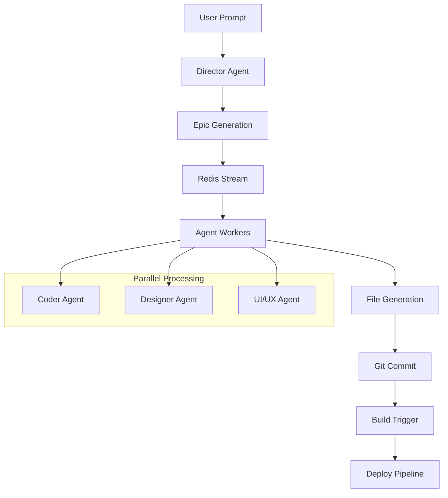
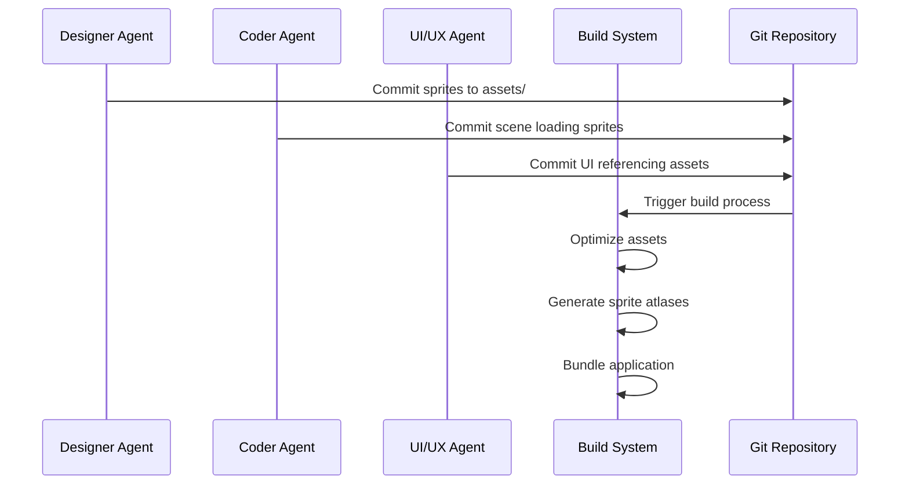

# Agent Studio Architecture

This document provides detailed technical architecture information for the Agent Studio autonomous development system.

## 🏗️ System Architecture

### High-Level Overview

```
┌─────────────────┐
│   User Input    │
│                 │
│ • Game Ideas    │
│ • Requirements  │
│ • Constraints   │
└─────────┬───────┘
          │
          ▼
┌─────────────────┐
│ Director Agent  │
│                 │
│ • Parse Prompt  │
│ • Create Epics  │
│ • Prioritize    │
└─────────┬───────┘
          │
          ▼
┌─────────────────┐    ┌─────────────────┐    ┌─────────────────┐
│  Redis Stream   │───▶│  Agent Workers  │───▶│  Git Repository │
│                 │    │                 │    │                 │
│ • Task Queue    │    │ • Coder         │    │ • Version Ctrl  │
│ • Priorities    │    │ • Designer      │    │ • Auto Commits  │
│ • Dependencies  │    │ • UI/UX         │    │ • Change Logs   │
└─────────────────┘    └─────────────────┘    └─────────────────┘
          │                       │                       │
          ▼                       ▼                       ▼
┌─────────────────┐    ┌─────────────────┐    ┌─────────────────┐
│   Monitoring    │    │   Build System  │    │  Deployment     │
│                 │    │                 │    │                 │
│ • Prometheus    │    │ • Vite          │    │ • Netlify       │
│ • Grafana       │    │ • Asset Opt     │    │ • CDN           │
│ • Sentry        │    │ • Hot Reload    │    │ • Analytics     │
└─────────────────┘    └─────────────────┘    └─────────────────┘
```

## 🧩 Component Details

### Director Agent

**Purpose**: Intelligent task decomposition and planning

**Architecture**:
```
User Prompt → LLM Analysis → Epic Generation → Priority Assignment → Queue Insertion
     ↓              ↓              ↓               ↓                  ↓
  Text Input   System Prompt   JSON Objects   Dependency Graph   Redis Stream
```

**Key Functions**:
- Natural language understanding
- Project scope analysis
- Task dependency resolution
- Resource estimation
- Epic standardization

**Technologies**:
- Node.js + Axios for LLM communication
- JSON schema validation
- Commander.js for CLI interface
- Chalk for colored output

### Specialized Agents

#### Coder Agent

**Purpose**: Game logic and systems implementation

**Architecture**:
```
Epic → Code Generation → File Writing → Git Commit → Result Reporting
  ↓         ↓              ↓            ↓             ↓
Task     Generated       Project      Version       Status
Queue    JavaScript      Files        Control       Update
```

**Specializations**:
- Phaser.js game engine expertise
- ES6+ modern JavaScript
- Physics systems integration
- Scene management
- Input handling systems

**Output Patterns**:
- `src/scenes/` - Game scenes
- `src/entities/` - Game objects
- `src/systems/` - Core systems
- `src/utils/` - Utility functions

#### Designer Agent

**Purpose**: Visual asset creation and optimization

**Architecture**:
```
Asset Spec → Image Generation → Format Conversion → File Organization → Commit
     ↓            ↓                   ↓                  ↓              ↓
  Prompt      Stable Diffusion      PNG/SVG/WebP      Asset Library   Git
  Parsing     or HF API             Optimization      Structure       Tracking
```

**Asset Types**:
- Character sprites (32x48, 64x64)
- Environment tiles (128x128)
- UI elements (scalable SVG)
- Backgrounds (1920x1080)
- Particle textures (16x16, 32x32)

**Fallback Strategy**:
1. Local Stable Diffusion (primary)
2. Hugging Face API (secondary)
3. Procedural generation (fallback)
4. Placeholder assets (emergency)

#### UI/UX Agent

**Purpose**: User interface design and experience optimization

**Architecture**:
```
UX Requirements → Design Generation → Prototype Creation → Integration Code → Testing
       ↓              ↓                    ↓                   ↓             ↓
   User Stories    HTML/CSS/JS         Interactive         Phaser UI      Usability
   Analysis        Templates           Mockups             Components     Validation
```

**Design Patterns**:
- Mobile-first responsive design
- Accessibility compliance (WCAG)
- Game UI conventions
- Performance optimization
- Cross-platform compatibility

### Infrastructure Layer

#### Redis Task Queue

**Purpose**: Distributed task management and coordination

**Stream Structure**:
```
agent_tasks: {
  id: "unique_epic_id",
  role: "coder|designer|uiux",
  prompt: "detailed_instructions",
  priority: 1-5,
  dependencies: ["epic_id1", "epic_id2"],
  created_at: "timestamp",
  status: "pending|processing|complete|failed"
}
```

**Consumer Groups**:
- `coder_agents` - Code generation workers
- `designer_agents` - Asset creation workers
- `uiux_agents` - Interface design workers

#### LLM Server

**Purpose**: Centralized language model inference

**Deployment Options**:

1. **Local Inference** (Recommended for development):
   ```
   llama.cpp → Quantized Model → HTTP API → Agent Clients
        ↓           ↓              ↓           ↓
   ROCm/CUDA    GGUF Format    Express.js   Axios Requests
   ```

2. **Container Deployment**:
   ```
   Docker → llama.cpp Image → Model Volume → Port 5000
      ↓         ↓                ↓            ↓
   Compose   Base Image      Bind Mount    Load Balancer
   ```

3. **Cloud Fallback**:
   ```
   OpenAI API → Rate Limiting → Response Caching → Error Handling
        ↓           ↓               ↓                ↓
   HTTP Requests  Token Mgmt    Redis Cache      Retry Logic
   ```

## 🔄 Data Flow Patterns

### Epic Processing Pipeline



### Asset Integration Flow



### Monitoring Data Flow

```
Application Metrics → Prometheus → Grafana Dashboards
       ↓                  ↓              ↓
  Performance KPIs    Time Series    Visual Analytics
  Resource Usage      Storage         Alerting Rules
  Error Rates         Queries         Team Notifications
```

## 📊 Performance Characteristics

### Latency Targets

| Component | Target | Acceptable | Critical |
|-----------|---------|------------|----------|
| Director Agent | <10s | <30s | <60s |
| Coder Agent | <30s | <2m | <5m |
| Designer Agent | <45s | <3m | <10m |
| UI/UX Agent | <20s | <1m | <3m |
| Build Process | <60s | <5m | <10m |

### Throughput Specifications

| Operation | Rate | Burst | Daily Limit |
|-----------|------|-------|-------------|
| Epic Creation | 10/min | 50/5min | 1000 |
| Code Generation | 5/min | 20/5min | 500 |
| Asset Creation | 2/min | 10/5min | 200 |
| UI Generation | 3/min | 15/5min | 300 |

### Resource Requirements

**Development Machine**:
- **CPU**: 8+ cores (Ryzen 5 3600+)
- **GPU**: 8GB+ VRAM (RX 6700 XT, RTX 3070+)
- **RAM**: 16GB minimum, 32GB recommended
- **Storage**: 100GB+ NVMe SSD

**Infrastructure Server**:
- **CPU**: 4+ cores for queue management
- **RAM**: 8GB for Redis and monitoring
- **Storage**: 50GB+ for logs and caching
- **Network**: Gigabit for asset transfer

## 🔐 Security Considerations

### Input Validation

```javascript
// Prompt sanitization
const sanitizePrompt = (input) => {
  return input
    .replace(/<script.*?>.*?<\/script>/gi, '')
    .replace(/[<>]/g, '')
    .substring(0, 5000);
};
```

### Access Control

```yaml
# Docker security
services:
  redis:
    command: redis-server --requirepass ${REDIS_PASSWORD}
  
  llm-server:
    environment:
      - API_KEY=${LLM_API_KEY}
```

### Content Safety

```python
# Asset generation filtering
SAFETY_PROMPTS = [
    "safe for work",
    "family friendly", 
    "game appropriate",
    "no violence",
    "cartoonish style"
]
```

## 🚀 Scalability Patterns

### Horizontal Scaling

```yaml
# Multiple agent instances
services:
  coder-agent-1:
    image: agent-studio/coder
    environment:
      - CONSUMER_NAME=coder_1
  
  coder-agent-2:
    image: agent-studio/coder
    environment:
      - CONSUMER_NAME=coder_2
```

### Load Balancing

```nginx
upstream llm_servers {
    server llm-server-1:5000;
    server llm-server-2:5000;
    least_conn;
}
```

### Caching Strategy

```javascript
// Response caching
const cache = new Map();
const getCachedResponse = (prompt) => {
  const hash = crypto.createHash('md5').update(prompt).digest('hex');
  return cache.get(hash);
};
```

## 🔧 Extension Points

### Custom Agent Types

```javascript
// Agent base class
class BaseAgent {
  constructor(role, redisUrl, llmUrl) {
    this.role = role;
    this.redis = createRedisClient(redisUrl);
    this.llm = new LLMClient(llmUrl);
  }
  
  async processTask(task) {
    // Override in subclasses
    throw new Error('processTask must be implemented');
  }
}
```

### Plugin Architecture

```javascript
// Plugin interface
const plugins = [
  new AssetOptimizationPlugin(),
  new CodeLintingPlugin(),
  new PerformanceMonitoringPlugin()
];

plugins.forEach(plugin => {
  if (plugin.canHandle(task)) {
    await plugin.process(task, context);
  }
});
```

### API Extensions

```javascript
// Custom endpoints
app.post('/api/v1/custom-generation', async (req, res) => {
  const result = await customGenerationPipeline(req.body);
  res.json(result);
});
```

This architecture enables the Agent Studio to scale from single-developer prototyping to production-grade autonomous development workflows.
